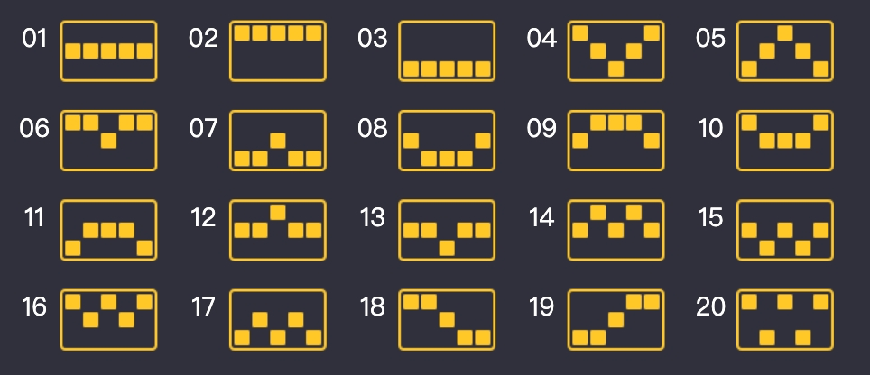

# 破茧成蝶 (pjcd) 代码功能与结构分析

## 一、游戏基础信息

| 属性 | 值 |
|------|-----|
| 游戏ID | 18984 |
| 游戏名称 | 破茧成蝶 (pjcd) |
| 盘面规格 | 3行 × 5列 |
| 中奖线数 | 20条 |
| 特色符号 | 多形态黏性百搭 (毛虫→蝶茧→蝴蝶)、SCATTER |
| 判奖类型 | LineGame (20条赔付线) |
| 核心机制 | 百搭形态进化、轮次倍数递增、蝴蝶百搭增加倍数 |

---

## 二、模块与职责

| 模块 | 路径 | 职责 |
|------|------|------|
| **对外入口** | `exported.go` | `NewBetOrder`（下注）、`MemberLogin`（登录） |
| **下注流程** | `bet_order.go`、`bet_order_*.go` | 下注主流程、场景管理、订单处理、余额扣减 |
| **旋转逻辑** | `bet_order_spin.go`、`bet_order_configs.go` | Base/Free 旋转、滚轮构建、线奖计算、倍数应用 |
| **登录** | `member_login.go` | 登录、场景恢复、上次订单回传 |
| **配置** | `game_json.go`、`bet_order_configs.go` | 配置加载、校验、赔付表、滚轮权重 |
| **常量与类型** | `const.go`、`types.go` | 游戏常量、矩阵/结果/场景类型定义 |

---

## 三、目录与文件结构

```
game/pjcd/
├── exported.go              # 游戏入口：NewBetOrder、MemberLogin
├── bet_order.go             # 下注主流程：betOrder → baseSpin → updateGameOrder → settleStep → getBetResultMap
├── bet_order_step.go        # 初始化/订单更新/余额结算
├── bet_order_scene.go       # 场景 Redis 读写：saveScene、reloadScene、cleanScene
├── bet_order_spin.go        # 旋转流程：processWin/processNoWin、倍数计算、免费触发
├── bet_order_helper.go      # 辅助函数、判奖、百搭形态：checkSymbolGridWin、calcWildForm、moveSymbols、isWild、isEmiWild
├── bet_order_configs.go     # 配置解析、滚轮构建：parseGameConfigs、initSpinSymbol、generateFullReelData、getStreakMultiplier
├── member_login.go          # 登录：memberLogin、doMemberLogin、selectOrderRedis
├── game_json.go             # 配置常量：_gameJsonConfigsRaw (pay_table/lines/real_data等)
├── const.go                 # 常量定义：GameID=18984、矩阵3x5、符号8=百搭/9=夺宝、_mask=10
├── types.go                 # 类型定义：int64Grid、int64GridW、WinInfo、SymbolRoller（SpinSceneData 在 bet_order_scene.go）
├── doc/
│   ├── README.md            # 规则说明
│   ├── rules.md             # 详细规则
│   └── game.json            # 示例配置
└── 文档/
    ├── 破茧成蝶 - 游戏设计分析.md     # 完整设计文档
    └── 破茧成蝶 - 轮轴构建机制分析.md # 滚轮构建详解
```

---

## 四、核心数据流

### 4.1 下注流程 `betOrder`（bet_order.go）

```
请求进入 (req)
    ↓
getRequestContext()           # 获取商户/会员/游戏信息
    ↓
client.BetLock.Lock()         # 用户锁
    ↓
GetLastOrder()                # 获取上次订单
    ↓
cleanScene()                  # 若无上次订单则清理场景
    ↓
reloadScene()                 # 从 Redis 加载场景 → syncGameStage() 判断是否免费局
    ↓
baseSpin()                    # 旋转逻辑 (见下节)
    ↓
updateGameOrder()             # 构建订单：fillInGameOrderDetails() 保存 symbolGrid/winGrid
    ↓
settleStep()                  # 余额结算：扣费/奖金/池记录
    ↓
saveScene()                   # 保存场景到 Redis
    ↓
getBetResultMap()             # 构建 proto 响应：Pjcd_BetOrderResponse + buildWinInfo()
    ↓
MarshalData()                 # proto.Marshal + json.MarshalToString → 返回 (pbData, jsonData, error)
```

### 4.2 旋转流程 `baseSpin`（bet_order_spin.go）

```
syncGameStage()               # 若开启调试则先同步 Stage/NextStage、isFreeRound
    ↓
initialize()                  # 首步扣费/校验或下一步 amount=0
    ↓
(免费且首步) 扣减免费次数 FreeNum--、IncrFreeTimes、Decr
    ↓
(Steps==0 且 Stage 为 Base/Free) initSpinSymbol() → 写入 scene.SymbolRoller
    ↓
handleSymbolGrid()            # 从 scene.SymbolRoller 构建 3×5 symbolGrid
    ↓
checkSymbolGridWin()          # 按20条线判奖 → WinInfo 列表、winGrid、winGridReward
    ↓
processWinInfos()             # calcWildForm()、updateGameMultiple()；有中奖→processWin(wildForm)，无→processNoWin()
```

#### processWin() 分支：
```
（processWinInfos 内已调用 calcWildForm、updateGameMultiple）
    ↓
handleWinElemsMultiplier()    # 线奖之和 → lineMultiplier
    ↓
stepMultiplier = lineMultiplier * gameMultiple
    ↓
isRoundOver = false
    ↓
scene.Steps++ / ContinueNum++
    ↓
scene.RoundMultiplier += stepMultiplier
    ↓
moveSymbols(wildForm)         # 中奖格消除；百搭若为蝴蝶( isEmiWild )则消除，否则保留为 wildForm 值(18/28)
    ↓
dropSymbols()                 # 按列下落填空
    ↓
fallingWinSymbols()           # 将 nextSymbolGrid 写回 scene.SymbolRoller，并 ringSymbol() 推进 Fall 索引
    ↓
NextStage = _spinTypeBaseEli / _spinTypeFreeEli
    ↓
updateBonusAmount(stepMultiplier)
```

#### processNoWin() 分支：
```
gameMultiple/lineMultiplier/stepMultiplier = 0
    ↓
isRoundOver = true
    ↓
scatterCount = getScatterCount()   # 统计 symbolGrid 中 _treasure(9) 个数（3×5 奖励区）
    ↓
scene.Steps = 0 / ContinueNum = 0
    ↓
仅基础模式：scene.TotalWildEliCount = 0；免费局结束时（FreeNum<=0）也置 0
    ↓
calcNewFreeGameNum(scatterCount)   # 基础：scatter>=min → FreeSpins+增量；免费再触发：scatter>=2 → TwoScatterAddTimes+增量
    ↓
Incr/FreeNum/addFreeTime 更新；SetLastWinId(0)
    ↓
免费结束：NextStage=_spinTypeBase；否则 NextStage=_spinTypeFree，IsRoundFirstStep=true；基础且 FreeNum>0 则 NextStage=_spinTypeFree
    ↓
updateBonusAmount(0)
```

### 4.3 滚轮构建（bet_order_configs.go）

**入口**：`initSpinSymbol()` 在 baseSpin 中当 `Steps==0` 且 Stage 为 Base/Free 时调用，根据 `isFreeRound` 取基础或免费轮轴，再 `buildBoardFromReelData` 得到 5 列 `SymbolRoller`。

**基础模式**（`getOrBuildBaseReelData`）：按 `base_reel_generate_interval`（默认 10）每 N 次重新 `generateFullReelData(false)`，否则复用 `scene.BaseReelData`。

**免费模式**（`getOrBuildFreeReelData`）：若无有效 `scene.FreeReelData` 则 `generateFullReelData(true)` 一次并缓存。

**单轴生成**（`generateReelSymbols`）：
1. **取符号**：`weightedRandomSymbolExcluding` 按权重选 1–7，排除上一符号
2. **排列长度**：`weightedRandomConsecutiveCount` 按 `symbol_permutation_weights` 选 1/2/3 连
3. **特殊替换**：`maybeReplaceSpecial` 按万分比 `scatter_prob`/`wild_prob` 替换为夺宝(9)/百搭(8)；百搭仅在第 2、3、4 列（col 1–3）允许

---

## 五、核心机制实现

### 5.1 百搭形态进化（bet_order_helper.go）

- **无独立 WildStateGrid**：百搭形态通过**符号值**编码。盘面/轮轴中百搭为 `8`、`18`、`28`（`_wild=8`，`_mask=10`，每次参与中奖加 10）。
- **形态含义**：`8` 毛虫、`18` 蝶茧、`28` 蝴蝶。`isWild(s)` 为 `s%10==8`，故 8/18/28 均视为百搭；`isEmiWild(s)` 为 `s/10>=3`，即 `28` 再参与一次中奖变为 `38` 后消除。
- **calcWildForm()**：遍历本轮的 `winGrid`，若某格中奖且为百搭则 `wildForm[r][c]=symbol+_mask`（8→18、18→28、28→38），并统计 `isEmiWild` 的个数累加到 `TotalWildEliCount`。
- **moveSymbols(wildForm)**：中奖格清空；若该格在 `wildForm` 中且**非** `isEmiWild`（即 18 或 28）则保留为 `wildForm` 值，否则置 0。下落由 `dropSymbols` 完成。
- **fallingWinSymbols**：将新盘面写回 `SymbolRoller.BoardSymbol`，并每列 `ringSymbol()` 推进 `Fall` 从轮轴取下一格补顶。

### 5.2 倍数计算（bet_order_spin.go + bet_order_configs.go）

- **getStreakMultiplier()** 仅返回 `(gameMul, index)`：`index = scene.ContinueNum`  capped 到 `len(multipliers)-1`，`gameMul = multipliers[index]`（基础 [1,2,3,5]、免费 [3,6,9,15]）。
- **updateGameMultiple()** 在 `processWinInfos` 内调用：先取 `gameMul, index`；若 `index >= 3` 且 `scene.TotalWildEliCount > 0`，则 `wildMultiplier = WildAddFourthMultiple * TotalWildEliCount`，最后 `gameMultiple = gameMul + wildMultiplier`。即第 4 轮及以后在基础倍数上叠加「蝴蝶百搭消除数 × 5」。

### 5.3 中奖判奖（bet_order_helper.go）

- **线判奖**：`checkSymbolGridWin()` 遍历 20 条线（`gameConfig.Lines`），每条线 5 个位置（0–14 行优先索引），从左到右 3+ 连续同符号即中奖。
- **百搭**：`currSymbol == symbol || isWild(currSymbol)`，`isWild(s)= (s%10==8)`，故 8/18/28 均可替代 1–7。
- **赔付**：`getSymbolBaseMultiplier(symbol, starN)` 查 `pay_table[symbol-1][starN-1]`；结果写入 `WinInfo.Odds`，线号写入 `LineCount`（0 起），中奖格写入 `WinGrid`。同时累加 `totalWinGrid`/`totalWinGridReward`（3×5）。

### 5.4 场景管理（bet_order_scene.go）

- **Key**：`sceneKey() = {Site}:scene-18984:{MemberID}`（无 merchantId）。
- **数据**：`SpinSceneData` 含 Stage/NextStage、FreeNum、Steps、ContinueNum、RoundMultiplier、SymbolRoller、BaseReelData/FreeReelData、BaseReelUseCount、IsRoundFirstStep、**TotalWildEliCount**（蝴蝶百搭累计消除数，基础每 spin 清空、免费累计）等；**无** WildStateGrid。
- **同步**：`syncGameStage()` 将 NextStage 赋给 Stage、清空 NextStage，`isFreeRound = (Stage==免费或免费消除)`；若 Steps==0 则 RoundMultiplier=0。

---

## 六、配置结构（game_json.go）

- **pay_table**：7 种符号×5 档（1~5 连）倍数，如 [0,0,2,5,10]
- **lines**：20 条赔付线，每条 5 个位置，**位置为 0–14**（3×5 行优先索引：0–4 第 0 行，5–9 第 1 行，10–14 第 2 行）
- **轮轴**：无 real_data；轮轴由 `generateFullReelData` / `generateReelSymbols` 按权重与概率动态生成
- **轮次倍数**：base_round_multipliers [1,2,3,5]、free_round_multipliers [3,6,9,15]
- **免费**：free_game_spins、free_game_scatter_min、free_game_add_spins_per_scatter、free_game_two_scatter_add_times
- **百搭**：wild_add_fourth_multiple=5（蝴蝶消除数×5 加在第 4 轮及以后倍数上）

---

## 七、类型与常量

- **矩阵类型**：`int64Grid [3][5]int64`、`int64GridW [3][5]int64`（奖励网格）；无 WildStateGrid，百搭形态编码在符号值中
- **符号**：0=空、1–7=普通符号、8=百搭、9=夺宝(Scatter)；百搭形态 8=毛虫、18=蝶茧、28=蝴蝶（数值为 8+_mask×次数，_mask=10）
- **阶段**：1=基础、11=基础消除、21=免费、22=免费消除

---

## 八、登录流程（member_login.go）

- **memberLogin**：取客户端场景 → 若无则返回空 → 取LastOrder → doMemberLogin
- **doMemberLogin**：按 key `{site}:{merchantId}:{memberId}:{gameId}:lastBetRecord` 取上次记录 → 拼装 orderMap（含lastOrder）→ 返回JSON

---

## 九、与其它游戏差异

| 对比项目 | pjcd | sgz | qlxr2 |
|----------|------|-----|-------|
| **Proto响应** | 有 Pjcd_BetOrderResponse | 有 Sgz_BetOrderResponse | 无，直接返回SpinResult JSON |
| **盘面** | 3×5 LineGame | 4×5 LineGame | 5×5 LineGame |
| **消除机制** | 有，连续消除倍增 | 有，连续消除倍增 | 无，单次旋转 |
| **百搭特色** | 三形态黏性进化 | 固定百搭 | 百搭扩展为整列 |
| **免费触发** | Scatter 3+个 | Scatter 统计 | Scatter 3+个 |
| **倍数系统** | 轮次倍增+蝴蝶额外 | 线倍+连续消除 | 列乘倍+全屏高倍 |
| **场景存储** | Redis | Redis | Redis |
| **订单落库** | 有 | 有 | 无 |

---

## 十、总结

| 维度 | 说明 |
|------|------|
| **功能** | 3×5消除LineGame，黏性三形态百搭，轮次倍数递增，蝴蝶百搭增加额外倍数，Scatter触发免费 |
| **结构** | 入口(exported) → 下注(bet_order) → 旋转流程(bet_order_spin) → 场景管理(bet_order_scene)，配置/常量/类型分离 |
| **数据流** | 请求 → 场景加载 → 旋转(判奖/消除/倍增/补位)循环 → 订单保存 → 场景保存 → Proto响应 |
| **核心特色** | 百搭形态进化(毛虫→蝶茧→蝴蝶)，第4轮倍数受蝴蝶影响，免费模式倍数累加 |
| **实现要点** | 百搭形态编码在符号值(8/18/28)，calcWildForm+moveSymbols 实现进化与保留，processWin/processNoWin 分支，Redis 持久化场景，支持断线重连 |

完整说明（含详细数据流、配置字段、机制实现、与其它游戏对比）已写在 **`/game/pjcd/ANALYSIS.md`**，可直接打开该文件查看。

---

## 十一、深度代码逻辑

### 11.A 初始化分支（initialize）

- **首步基础 spin**（`!isFreeRound && scene.Steps==0`）：`initFirstStepForSpin()` — 非 debug 时 `updateBetAmount()`、`checkBalance()`，设置 `amount=betAmount`，Reset 免费相关、SetBetAmount、SetLastWinId。
- **其余**：`initStepForNextStep()` — 非 debug 时从 lastOrder 取 BaseMoney/Multiple，`amount=0`；debug 时 betAmount 固定、amount=0。

### 11.B processWinInfos 顺序

1. `addFreeTime=0`
2. **calcWildForm()**：遍历 `winGrid`，中奖且 `isWild(symbolGrid[r][c])` 则 `wildForm[r][c]=symbol+_mask`，并若 `isEmiWild(wildForm[r][c])` 则 `addWildEliCount++`；最后 `scene.TotalWildEliCount += addWildEliCount`。
3. **updateGameMultiple()**：`gameMultiple, gameMultipleIndex = getStreakMultiplier()`；若 `index>=3 && TotalWildEliCount>0` 则 `wildMultiplier = WildAddFourthMultiple * TotalWildEliCount`；`gameMultiple += wildMultiplier`。
4. 有 `winInfos` 则 **processWin(wildForm)**，否则 **processNoWin()**。

### 11.C 判奖与线结构

- **Lines**：20 条线，每条 5 个元素，为 0–14 的索引（row = p/5, col = p%5）。从左到右即按 line 顺序取格，`r >= _rowCountReward(3)` 即越界则 break。
- **符号**：只对 1–7 逐符号尝试整线匹配；`isWild(currSymbol)` 即 `currSymbol%10==8`，可与任意 1–7 匹配。
- **赢线**：同一线、同一符号、连续 3/4/5 格，且 `getSymbolBaseMultiplier(symbol, count)>0` 才加入 winInfos；同一格可被多条线复用，winGrid 按格累加标记。

### 11.D 消除与下落（moveSymbols + dropSymbols + fallingWinSymbols）

- **moveSymbols**：对 `winGrid[r][c]>0` 的格，若 `wildForm[r][c]>0` 且 **非** `isEmiWild(wildForm[r][c])` 则保留 `nextSymbolGrid[r][c]=wildForm[r][c]`（18 或 28），否则置 0。然后 **dropSymbols**：每列从上往下写，非 0 的格依次压到列顶。
- **fallingWinSymbols**：把 `nextSymbolGrid` 按「行反序」写回 `scene.SymbolRoller[c].BoardSymbol`（因为 BoardSymbol 的索引 0 是视觉上的顶），再对每列调用 **ringSymbol()**：列内 0 格从 `Fall` 取下一个轮轴符号填入，并 `Fall = (Fall+1)%len(Reel)`。

### 11.E 免费次数（calcNewFreeGameNum）

- **基础模式**：`scatterCount >= FreeGameScatterMin` 时，`FreeGameSpins + (scatterCount - FreeGameScatterMin) * FreeGameAddSpinsPerScatter`。
- **免费模式再触发**：`scatterCount >= 2` 时，`FreeGameTwoScatterAddTimes + (scatterCount - 2) * FreeGameAddSpinsPerScatter`。

### 11.F 场景与订单

- **订单号**：非 debug 时 `common.GenerateOrderSn(..., scene.Stage==Base, scene.Stage==Free||FreeEli)`。
- **fillInGameOrderDetails**：BetRawDetail = symbolGrid JSON，BonusRawDetail = winGridReward JSON（3×5），WinDetails = buildWinInfo() JSON。
- **calcRoundWin**：`betAmount * scene.RoundMultiplier / _baseMultiplier`，用于 proto 的 RoundWin。

---

## 十二、盘面变化流程

### 12.1 单轮完整变化

```
滚轴配置Index: 0
转轮信息长度/起始：100[18～21]  100[39～42]  100[99～2]  100[93～95]  100[14～16]
滚轴数据:
  [2  1  1  4  9  5  4  7  7  1  2  1  4  4  2  1  1  7 (2  3  4) 2  4  4  5  7  6  7  6  1  6  3  2  3  6  2  1  3  6  4  3  2  3  3  2  6  5  1  7  3  6  3  1  3  1  2  3  3  1  3  2  6  2  5  1  2  5  5  5  7  4  1  1  6  6  5  6  2  1  2  1  6  6  6  7  4  6  6  7  4  6  1  6  4  6  6  5  2  3  1]
  [4  4  3  5  2  1  2  6  6  6  3  4  7  3  5  4  6  6  1  1  2  8  7  3  2  1  2  5  6  6  6  1  1  6  2  7  7  5  8 【4 3  1) 6  3  6  7  3  7  2  5  2  4  2  2  5  7  1  3  3  1  4  7  3  3  7  7  2  5  1  7  4  3  7  3  4  1  1  2  1  2  4  6  5  1  3  4  6  6  2  1  6  6  4  1  2  4  7  3  5  1]
  [7  1  3  3  7  2  2  6  3  2  7  6  9  3  4  5  6  3  2  8  6  9  5  3  1  2  2  4  1  5  1  4  1  3  3  6  7  4  4  6  5  3  3  1  1  1  4  1  7  7  4  2  2  1  2  4  8  1  2  3  3  1  1  2  7  7  4  2  6  8  1  4  2  1  1  5  2  6  1  3  2  1  2  2  3  2  9  3  5  5  4  5  2  2  4  4  4  3  1 (3]
  [1  1  3  3  7  2  6  8  4  5  6  8  7  7  5  1  3  5  3  6  3  6  6  7  7  1  1  5  2  8  3  1  1  7  4  2  4  4  7  4  6  6  2  4  1  4  4  8  1  1  2  5  6  6  7  2  5  6  3  1  5  6  6  5  3  1  7  7  4  1  1  7  6  7  9  7  2  3  6  7  6  3  6  5  4  6  4  2  2  1  1  4  4 (4  5  3) 1  3  3  3]
  [2  5  2  6  3  2  5  9  7  7  4  2  6  4 (3  4  5) 4  4  1  3  2  1  1  6  4  6  5  5  7  4  6  4  4  4  3  3  2  5  4  2  1  7  1  2  3  5  2  1  2  1  4  3  7  1  5  3  1  5  4  3  3  6  6  3  2  3  6  1  3  4  2  4  1  3  4  3  1  4  1  2  2  3  4  3  7  7  2  2  4  4  1  6  2  2  6  2  2  1  2]

Step1 初始盘面:
  4 |   1 |   1 |   3 |   5 |
  3 |   3 |   7 |   5 |   4 |
  2 |   4 |   3 |   4 |   3 |
           ↓
Step1 中奖标记:
  4 |   1 |   1 |   3 |   5 |
  3*|   3*|   7 |   5 |   4 |
  2 |   4 |   3*|   4 |   3 |
           ↓
Step1 下一盘面预览（实际消除+下落+填充结果）:
    |     |     |   3 |   5 |
  4 |   1 |   1 |   5 |   4 |
  2 |   4 |   7 |   4 |   3 |
           ↓
Step1 中奖详情:
    符号: 3, 支付线:13, 乘积: 3, 赔率: 5.00, 下注: 1×1, 奖金: 5.00
    Mode=0, RoundMul: 5, stepMul: 5, lineMul: 5, gameMul: 1, 累计中奖: 5.00
    MulList:[1 2 3 5], ContinueNum: 1, gameMul: 1, butterflyMul: 0, addButterflyCnt: 0, TotalWildEliCount: 0
    🔁 连消继续 → Step2

Step2 初始盘面:
  2 |   6 |   3 |   3 |   5 |
  4 |   1 |   1 |   5 |   4 |
  2 |   4 |   7 |   4 |   3 |
           ↓
Step2 中奖详情:
    未中奖 → 回合结束
```

### 12.2 倍数累加

```
基础模式: [1, 2, 3, 5]     免费模式: [3, 6, 9, 15]

第1轮: 倍数1 × 线奖 = step1  →  RoundMul = step1
第2轮: 倍数2 × 线奖 = step2  →  RoundMul += step2
第3轮: 倍数3 × 线奖 = step3  →  RoundMul += step3
第4轮: 倍数5 × 线奖 = step4  →  RoundMul += step4
        ↑
   若有蝴蝶: 倍数 += TotalWildEliCount × 5
```

### 12.4 Wild 进化（符号值 8→18→28→消除）

```
   【初始】           【首次参与中奖】    【再次参与中奖】    【第三次参与中奖】
   百搭 8 (毛虫)  ──►  18 (蝶茧)    ──►  28 (蝴蝶)    ──►  38 → 消除，TotalWildEliCount++
   保留在盘面          保留在盘面          保留在盘面

   计算方式：wildForm[r][c] = symbol + _mask(10)；isEmiWild(s) = s/10>=3 → 38 消除
   第 4 轮及以后倍数额外增加：gameMultiple += TotalWildEliCount × wild_add_fourth_multiple(5)
```

---

## 十三、中奖线图示

